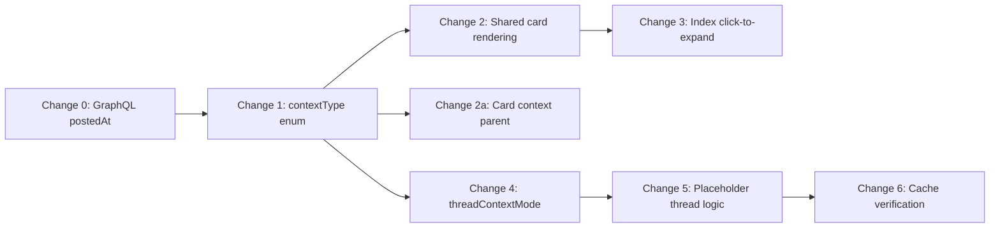

# User Archive Refactor V2 — Detailed Implementation Plan

## Overview

Six changes to the User Archive. Each change includes exact file paths, line numbers, code snippets, and rationale.

### Design Principles Applied

Three cross-cutting simplifications shape every change below:

1. **`contextType` enum replaces boolean flags** — Currently there are three ad-hoc flags on Comment objects: `isPlaceholder`, `isContext`, and the proposed `isContextPlaceholder`. These are mutually exclusive states represented as unrelated booleans — a classic code smell. This plan replaces them with a single discriminated field:
   ```typescript
   type ContextType = 'missing' | 'fetched' | 'stub';
   // missing = structural placeholder (was isPlaceholder) — invisible empty div
   // fetched = full context comment loaded from server (was isContext) — renders fully, marked read
   // stub    = metadata-only from parentComment ref (new) — renders header-only
   // undefined = normal user-authored comment
   ```
   **Migration surface** (all `as any` casts, greppable):
   - `isContext` — 12 sites across 4 files (`comment.ts`, `render/index.ts`, `powerReaderHost.ts`, `archive/uiHost.ts`)
   - `isPlaceholder` — 6 sites across 3 files (`comment.ts`, `post.ts`, `services/loader.ts`)

2. **Card View calls `renderComment` directly** — Not `renderPostGroup`. A PostGroup adds post headers, tree-karma sorting, placeholder insertion, and collapse logic that make no sense for a flat card list. Calling `renderComment(item, state)` directly gives identical CSS classes and metadata rendering without the overhead.

3. **Layout vs context strategy are separate concerns** — Instead of splitting `'thread'` into `'thread-full' | 'thread-placeholder'` (which creates shotgun surgery at every `=== 'thread'` check), we keep `viewMode: 'thread'` and add a separate `threadContextMode: 'full' | 'placeholder'` field on `ArchiveState`. With a helper `isThreadMode(m)`, existing checks remain untouched.

---

## Change 0 (Prerequisite): Add `postedAt` to `parentComment` in GraphQL

**Goal**: Context placeholders need a timestamp to display.

### Current State

[COMMENT_FIELDS_CORE](file:///c:/Users/Wei%20Dai/Code/userscripts/src/shared/graphql/queries.ts#L59-L112) has 5 nesting levels of `parentComment`, each with only `_id` and `parentCommentId`. Level-1 also has `user`.

### Plan

#### [MODIFY] [queries.ts](file:///c:/Users/Wei%20Dai/Code/userscripts/src/shared/graphql/queries.ts)

**GraphQL fragment** (lines 82-97): Add `postedAt` at every nesting level:

```diff
 parentComment {
   _id
+  postedAt
   parentCommentId
   parentComment {
     _id
+    postedAt
     parentCommentId
     parentComment {
       _id
+      postedAt
       parentCommentId
       parentComment {
         _id
+        postedAt
         parentCommentId
         parentComment {
           _id
+          postedAt
           parentCommentId
         }
       }
     }
   }
   user {
     _id
     username
     displayName
   }
 }
```

**TypeScript type** — Update `ParentCommentRef` (approx L456-465):

```diff
 export type ParentCommentRef = {
   _id: string;
+  postedAt?: string;
   parentCommentId: string | null;
   parentComment?: ParentCommentRef | null;
   user?: { _id: string; username: string; displayName: string; } | null;
 };
```

---

## Change 1: Introduce `contextType` Enum

**Goal**: Replace `isPlaceholder`, `isContext`, and the proposed `isContextPlaceholder` with a single `contextType` field.

### Migration Table

| Old flag | New value | Meaning | Rendering |
|---|---|---|---|
| `isPlaceholder: true` | `contextType: 'missing'` | Structural gap (parent not in any query) | Invisible div |
| `isContext: true` | `contextType: 'fetched'` | Full comment loaded for ancestry | Full render, marked read |
| *(new)* | `contextType: 'stub'` | Metadata-only from `parentComment` ref | Header-only, 80% font |
| *(none set)* | `undefined` | Normal user-authored comment | Normal render |

### Files to Modify

#### [MODIFY] [comment.ts](file:///c:/Users/Wei%20Dai/Code/userscripts/src/scripts/power-reader/render/comment.ts)

1. Replace `isPlaceholderComment` check (L88-90, L202):
   ```diff
   - const isPlaceholderComment = (comment: Comment): boolean => {
   -   return (comment as unknown as { isPlaceholder?: boolean }).isPlaceholder === true;
   - };
   + const getContextType = (comment: Comment): string | undefined =>
   +   (comment as any).contextType;
   ```

2. Replace the branching at top of `renderComment` (L201-204):
   ```diff
   - if (isPlaceholderComment(comment)) {
   -   return renderMissingParentPlaceholder(comment, repliesHtml);
   - }
   + const ct = getContextType(comment);
   + if (ct === 'missing') return renderMissingParentPlaceholder(comment, repliesHtml);
   + if (ct === 'stub') return renderContextPlaceholder(comment, state, repliesHtml);
   ```

3. Replace `(comment as any).isContext` reads (L209, L237, L258) with `ct === 'fetched'`:
   ```diff
   - const commentIsRead = (comment as any).isContext || isLocallyRead;
   + const commentIsRead = ct === 'fetched' || isLocallyRead;
   ...
   - const isContext = (comment as any).isContext;
   + const isContext = ct === 'fetched';
   ```

4. Add `renderContextPlaceholder` function (new, placed near `renderMissingParentPlaceholder`):
   ```typescript
   const renderContextPlaceholder = (
     comment: Comment, state: ReaderState, repliesHtml: string = ''
   ): string => {
     const metadataHtml = renderMetadata(comment, {
       state,
       style: 'font-size: 80%;',
       isFullPost: false, // hides vote buttons
     });
     return `
       <div class="pr-comment pr-item context pr-context-placeholder"
            data-id="${comment._id}"
            data-parent-id="${comment.parentCommentId || ''}"
            data-post-id="${comment.postId}">
         ${metadataHtml}
         ${repliesHtml}
       </div>
     `;
   };
   ```

   > **Why `isFullPost: false`?** — [renderMetadata](file:///c:/Users/Wei%20Dai/Code/userscripts/src/scripts/power-reader/render/components/metadata.ts#L45) passes this to `renderVoteButtons` as the `showButtons` param. Setting it to `false` hides all vote controls. No body div is emitted.

#### [MODIFY] [post.ts](file:///c:/Users/Wei%20Dai/Code/userscripts/src/scripts/power-reader/render/post.ts)

Replace `isPlaceholder: true` in `createMissingParentPlaceholder` (L47):
```diff
- isPlaceholder: true,
+ contextType: 'missing',
```

#### [MODIFY] [render/index.ts](file:///c:/Users/Wei%20Dai/Code/userscripts/src/scripts/power-reader/render/index.ts)

Replace `isContext` reads in `buildPostGroups` (L82, L87, L88):
```diff
- const isContext = (c as any).isContext;
+ const isContext = (c as any).contextType === 'fetched' || (c as any).contextType === 'stub';
```

#### [MODIFY] [powerReaderHost.ts](file:///c:/Users/Wei%20Dai/Code/userscripts/src/scripts/power-reader/render/powerReaderHost.ts)

Replace `isContext` assignment in `mergeComments` (L90):
```diff
- if (markAsContext) (c as any).isContext = true;
+ if (markAsContext) (c as any).contextType = 'fetched';
```

#### [MODIFY] [archive/uiHost.ts](file:///c:/Users/Wei%20Dai/Code/userscripts/src/scripts/power-reader/archive/uiHost.ts)

1. Replace `isContext` assignment in `mergeComments` (L193):
   ```diff
   - if (markAsContext) (c as any).isContext = true;
   + if (markAsContext && !(c as any).contextType) (c as any).contextType = 'fetched';
   ```
   > The `&& !contextType` guard preserves stubs — if a comment already has `contextType: 'stub'`, we don't overwrite it to `'fetched'`.

2. Replace context preservation filter in `rerenderAll` (L103-104):
   ```diff
   - const existingContext = this.readerState.comments.filter(c => (c as any).isContext === true);
   - const existingPosts = this.readerState.posts.filter(p => (p as any).isContext === true);
   + const existingContext = this.readerState.comments.filter(c => !!(c as any).contextType);
   + const existingPosts = this.readerState.posts.filter(p => !!(p as any).contextType);
   ```

#### [MODIFY] [services/loader.ts](file:///c:/Users/Wei%20Dai/Code/userscripts/src/scripts/power-reader/services/loader.ts)

Replace `isPlaceholder` check in `mergeComment` helper (L352):
```diff
- if ((existing as any).isPlaceholder) {
+ if ((existing as any).contextType === 'missing') {
```

#### [MODIFY] [archive/index.ts](file:///c:/Users/Wei%20Dai/Code/userscripts/src/scripts/power-reader/archive/index.ts) (CSS block)

Add CSS for the new context placeholder class:
```css
.pr-context-placeholder {
  opacity: 0.7;
  border-left: 2px solid #555;
  padding-left: 8px;
}
```

---

## Change 2: Card View Uses Shared Rendering

**Goal**: Card view adopts Power Reader's `renderComment` / `renderPostBody` instead of its own bespoke HTML.

### Current State

[renderCardItem](file:///c:/Users/Wei%20Dai/Code/userscripts/src/scripts/power-reader/archive/render.ts#L270-L297) produces custom HTML with `.pr-archive-item` classes — completely separate from the mainstream `.pr-comment` / `.pr-item` classes.

### Plan

#### [MODIFY] [archive/render.ts](file:///c:/Users/Wei%20Dai/Code/userscripts/src/scripts/power-reader/archive/render.ts)

Rewrite `renderCardItem` to delegate to shared renderers:

```typescript
const renderCardItem = (item: Post | Comment, state: ReaderState): string => {
  const isPost = 'title' in item;
  
  if (isPost) {
    // Render post header + body using shared components
    const post = item as Post;
    const headerHtml = renderPostHeader(post, { isFullPost: true, state });
    const bodyHtml = post.htmlBody ? renderPostBody(post) : '';
    return `
      <div class="pr-post pr-item" data-id="${post._id}" data-post-id="${post._id}">
        ${headerHtml}
        ${bodyHtml}
      </div>
    `;
  }
  
  // Comment: render with shared renderComment
  return renderComment(item as Comment, state);
};
```

Update `renderArchiveFeed`'s card branch to pass `state`:
```diff
- html += renderCardItem(item);
+ html += renderCardItem(item, state);
```

> **Why not `renderPostGroup`?** — PostGroup adds `withMissingParentPlaceholders`, `buildChildrenIndex`, `calculateTreeKarma`, and a post header wrapping every comment — heavy machinery for a flat card list. Calling `renderComment` directly gets identical CSS classes, metadata, vote buttons, and score coloring, without the tree overhead.

---

## Change 2a: Card View Shows One Contextual Parent

**Goal**: Each comment card shows its immediate parent as a `stub` context placeholder above it.

#### [MODIFY] [archive/render.ts](file:///c:/Users/Wei%20Dai/Code/userscripts/src/scripts/power-reader/archive/render.ts)

Add a helper and update the card renderer:

```typescript
import type { ParentCommentRef } from '../../../shared/graphql/queries';

/**
 * Convert a ParentCommentRef (from the GraphQL parentComment chain)
 * into a minimal Comment suitable for renderContextPlaceholder.
 */
const parentRefToStub = (ref: ParentCommentRef, sourceComment: Comment): Comment => ({
  _id: ref._id,
  postedAt: ref.postedAt || '',
  parentCommentId: ref.parentCommentId || '',
  user: ref.user ? { ...ref.user, slug: '', karma: 0, htmlBio: '' } : null,
  postId: sourceComment.postId,
  post: sourceComment.post ?? null,
  htmlBody: '', baseScore: 0, voteCount: 0, pageUrl: '',
  author: ref.user?.username || '', rejected: false,
  topLevelCommentId: sourceComment.topLevelCommentId || ref._id,
  parentComment: null, extendedScore: null, afExtendedScore: null,
  currentUserVote: null, currentUserExtendedVote: null,
  contents: { markdown: null },
  contextType: 'stub',
} as any as Comment);
```

Then in `renderCardItem`, prepend context before the comment:

```typescript
const renderCardItem = (item: Post | Comment, state: ReaderState): string => {
  const isPost = 'title' in item;
  
  if (isPost) { /* ... post rendering as above ... */ }
  
  const comment = item as Comment;
  let contextHtml = '';
  
  // Show immediate parent as stub placeholder
  if (comment.parentCommentId && comment.parentComment) {
    contextHtml = renderComment(parentRefToStub(comment.parentComment, comment), state);
  }
  
  return contextHtml + renderComment(comment, state);
};
```

---

## Change 3: Index View Click-to-Expand

**Goal**: Clicking an index row expands it in-place to its card rendering.

#### [MODIFY] [archive/render.ts](file:///c:/Users/Wei%20Dai/Code/userscripts/src/scripts/power-reader/archive/render.ts)

1. Add `data-action="expand-index-item"` + `cursor: pointer` to the index item div.
2. Export `renderCardItem` and `renderIndexItem` (currently module-private).

#### [MODIFY] [archive/index.ts](file:///c:/Users/Wei%20Dai/Code/userscripts/src/scripts/power-reader/archive/index.ts)

Add a single delegated click handler on `feedEl`:

```typescript
feedEl.addEventListener('click', (e) => {
  const target = e.target as HTMLElement;
  
  // Expand: index row → card
  const expandTarget = target.closest('[data-action="expand-index-item"]');
  if (expandTarget) {
    const id = expandTarget.getAttribute('data-id');
    const item = id ? state.itemById.get(id) : null;
    if (!item) return;
    
    const wrapper = document.createElement('div');
    wrapper.className = 'pr-index-expanded';
    wrapper.setAttribute('data-id', id!);
    wrapper.innerHTML = `
      <button class="pr-button pr-index-collapse-btn"
              data-action="collapse-index-item" data-id="${id}">▲ Collapse</button>
      ${renderCardItem(item, uiHost.getReaderState())}
    `;
    expandTarget.replaceWith(wrapper);
    return;
  }
  
  // Collapse: card → index row
  const collapseTarget = target.closest('[data-action="collapse-index-item"]');
  if (collapseTarget) {
    const id = collapseTarget.getAttribute('data-id');
    const item = id ? state.itemById.get(id) : null;
    if (!item) return;
    
    const expanded = collapseTarget.closest('.pr-index-expanded');
    if (expanded) {
      const tmp = document.createElement('div');
      tmp.innerHTML = renderIndexItem(item);
      expanded.replaceWith(tmp.firstElementChild!);
    }
    return;
  }
});
```

---

## Change 4: Thread View Context Mode Selector

**Goal**: Let users choose between full context (fetches bodies) and placeholder context (metadata-only, no network).

### Plan

Keep `viewMode: 'thread'` unchanged. Add a **separate** `threadContextMode` field.

#### [MODIFY] [archive/state.ts](file:///c:/Users/Wei%20Dai/Code/userscripts/src/scripts/power-reader/archive/state.ts)

```diff
+ export type ThreadContextMode = 'full' | 'placeholder';

  export interface ArchiveState {
    // ...existing fields...
    viewMode: ArchiveViewMode;  // stays 'card' | 'index' | 'thread'
+   threadContextMode: ThreadContextMode;
    sortBy: ArchiveSortBy;
    // ...
  }
```

Update `createInitialArchiveState`:
```diff
  viewMode: 'card',
+ threadContextMode: 'full',
  sortBy: 'date',
```

#### [MODIFY] [archive/index.ts](file:///c:/Users/Wei%20Dai/Code/userscripts/src/scripts/power-reader/archive/index.ts) (UI)

Add a secondary dropdown that appears when thread view is selected:

```html
<select id="archive-thread-context" style="display: none;">
  <option value="full">Full Context</option>
  <option value="placeholder">Placeholder Context</option>
</select>
```

Show/hide it when the view mode dropdown changes:
```typescript
viewModeSelect.addEventListener('change', () => {
  threadContextSelect.style.display = viewModeSelect.value === 'thread' ? '' : 'none';
});
```

> **Why not two separate view mode values?** — Every existing `viewMode === 'thread'` check (sorting guards, render-count dialogs, post-render hooks) would need updating to `=== 'thread-full' || === 'thread-placeholder'`. By keeping `'thread'` as one mode and adding a separate control, zero existing checks need changes.

---

## Change 5: Placeholder Thread View Logic

**Goal**: When `threadContextMode === 'placeholder'`, skip `ensureContextForItems` (no server fetch) and instead create stub comments locally.

#### [MODIFY] [archive/render.ts](file:///c:/Users/Wei%20Dai/Code/userscripts/src/scripts/power-reader/archive/render.ts)

1. In the thread branch of `renderArchiveFeed`, check the context mode:
   ```typescript
   } else if (viewMode === 'thread') {
     if (archiveState.threadContextMode === 'full') {
       await ensureContextForItems(visibleItems, state);
     } else {
       ensurePlaceholderContext(visibleItems, state);
     }
     renderThreadView(container, visibleItems, state, sortBy);
   }
   ```

   > Note: `renderArchiveFeed` needs access to `archiveState` for `threadContextMode`. The simplest way is to pass it as a parameter or access it via `getUIHost()`.

2. Add the new **synchronous** `ensurePlaceholderContext` function:
   ```typescript
   /**
    * Create stub context comments from the parentComment chain data
    * already present in each comment's GraphQL response.
    * No network requests needed.
    */
   const ensurePlaceholderContext = (
     items: (Post | Comment)[], state: ReaderState
   ): void => {
     const stubs: Comment[] = [];
     const seen = new Set<string>();
     
     for (const item of items) {
       if ('title' in item) continue;
       const comment = item as Comment;
       let current = comment.parentComment as any;
       
       while (current?._id) {
         if (state.commentById.has(current._id) || seen.has(current._id)) break;
         seen.add(current._id);
         stubs.push(parentRefToStub(current, comment));
         current = current.parentComment;
       }
     }
     
     if (stubs.length > 0) {
       getUIHost().mergeComments(stubs, true);
     }
   };
   ```

   > **Key insight**: `parentRefToStub` (from Change 2a) sets `contextType: 'stub'`. The `mergeComments` call in `archive/uiHost.ts` guards against overwriting existing `contextType`, so if the user switches from placeholder to full context, the stubs get replaced by fully-fetched comments.

---

## Change 6: Cache Verification

**Goal**: Ensure context comments (both `'fetched'` and `'stub'`) persist in memory across view switches.

### Already Works

[ArchiveUIHost.rerenderAll](file:///c:/Users/Wei%20Dai/Code/userscripts/src/scripts/power-reader/archive/uiHost.ts#L95-L145) already preserves context comments across rerenders (L103-136). With Change 1's migration to `contextType`, the filter becomes `!!(c as any).contextType` which catches all three types (`'missing'`, `'fetched'`, `'stub'`).

### Action: Verify only

No additional code needed beyond what Change 1 already does. Just verify manually that:
1. Switch to Thread (Full Context) → context fetched
2. Switch to Card View → switch back to Thread → stale context still present (no re-fetch)
3. Switch to Thread (Placeholder Context) → stubs created
4. Switch to Card View → switch back to Thread (Placeholder) → stubs still present

---

## Implementation Order



1. **Change 0** — GraphQL prerequisite
2. **Change 1** — `contextType` enum (foundational refactor, touches many files, do this early while context is fresh)
3. **Changes 2 + 2a** — Card view refactor (depends on 1 for `contextType: 'stub'`)
4. **Change 4** — State + UI for thread context mode
5. **Change 5** — Placeholder thread logic (depends on 4 for `threadContextMode`)
6. **Change 3** — Index click-to-expand (independent, can be done anytime after 2)
7. **Change 6** — Cache verification (just manual testing)

---

## Verification Plan

### Automated

```bash
# Build to verify no TypeScript errors:
npm run build

# Run existing archive tests:
npx playwright test tests/archive-route.spec.ts tests/archive-sync.spec.ts
```

### Manual

1. Open User Archive for a user with comments
2. **Card View**: Each comment renders with Power-Reader-style metadata (score colors, author controls, reactions). Each comment shows one contextual parent above it with header-only at 80% font.
3. **Index View**: Click an item → expands in-place to Card rendering with a "Collapse" button. Click Collapse → returns to index row.
4. **Thread (Full Context)**: Identical to current Thread View behavior — parent comments fully fetched with bodies.
5. **Thread (Placeholder Context)**: Parent comments show as header-only (author + date, 80% font). **Verify no network requests** in DevTools Network tab.
6. **View switching**: Switch between all four views rapidly. No stale data, no missing context, no duplicate entries.
